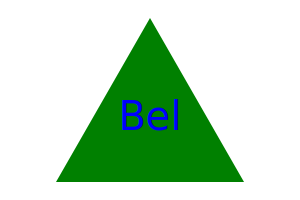
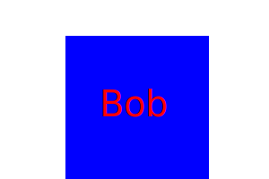

# Logo-Maker

## Table of Contents

 * [Description](#description)

 * [Live-Screen-Recording-of-Application-Functionality](#live-screen-recording-of-application-functionality)

 * [Screenshots](#screenshots)

 * [Technologies-Used](#technologies-used)

 * [Installation](#installation)

 * [Features](#features)

 * [Information-Usage](#information-usage)

 * [License](#license)

## Description

The purpose of this program is to enable independent web developers to generate basic logos for their projects and clients without having to pay a graphic designer. With the usage of inquirer, the user is prompted in the command line to specify the desired appearance of their logo, including the text to be shown (up to three characters), the color of the text, the logo's shape (triangle, square, or circle), and the color of the shape. After the user completes all questions, a logo is created utilizing their selections in an SVG file.

## Live Screen Recording of Application Functionality

[git@github.com:brycehadl/Logo.Maker.git](https://drive.google.com/file/d/14OE4AmFV3LSOEiZJurpC4jeEDQiV-yPy/view)

## Screenshots

Examples of Generated Logos

## Technologies Used

This project uses the file system module (a node package manager) and inquirer v8.2.4 (a node package manager) and is driven by Node.js v16. Additionally, it uses the node package manager jest v29.5.0 for the unit testing that is done in this application. 

## Installation

1. Clone the repo:
   git clone git@github.com/brycehadl/Logo.Maker.git

2. Open in VS Code. If you do not have VS code you must install it.

3. Proceed to install node.js v16 through the terminal. The command to run if you have homebrew should be something like this: brew install node@16. Nevertheless, this might not always work as expected, so you should check the instructions.

4. After installing node.js v16, initialize and create a package.json in the terminal by using the command npm init -y. This is where project files will be kept.

5. Next, install the application's dependencies using the terminal by running the command npm i. Developers may also need to install inquirer and jest directly from the command line; for inquirer, this is npm i inquirer@8.2.4 to install the most recent version of the inquirer, and npm i jest to install the most recent version of jest.

6. Enter the command node index.js in the terminal to launch the application.

## Features

One of the features of this program is that users may create logos completely from the command line, swiftly and simply by using SVG files. Not a front end tool or user interface is required.  

## Information Usage

Use the command line to launch this application by going to the application directory, installing all dependencies (npm i), and then using the node index.js command. After that, you'll be asked a series of questions. Your logo has been produced, the command line will indicate when all questions have been correctly answered. Locate your updated logo in the freshly created SVG file.

Go to the Test guidance section for guidance on unit testing.

## License

This application is covered under the MIT License
